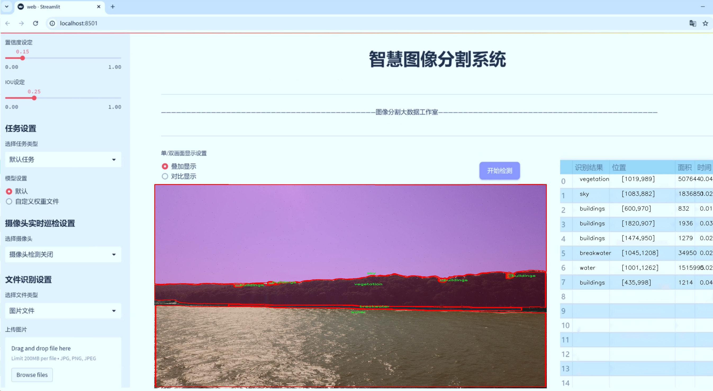
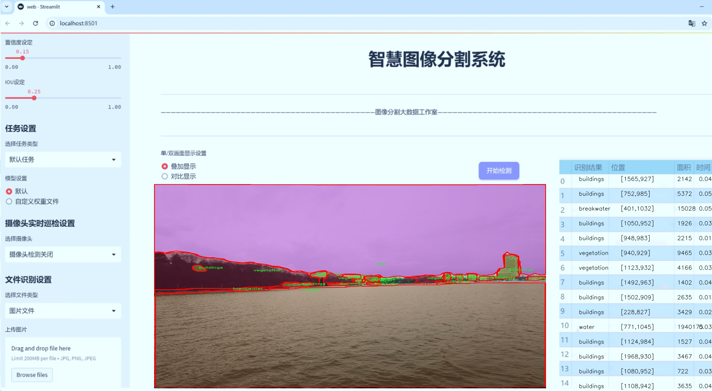
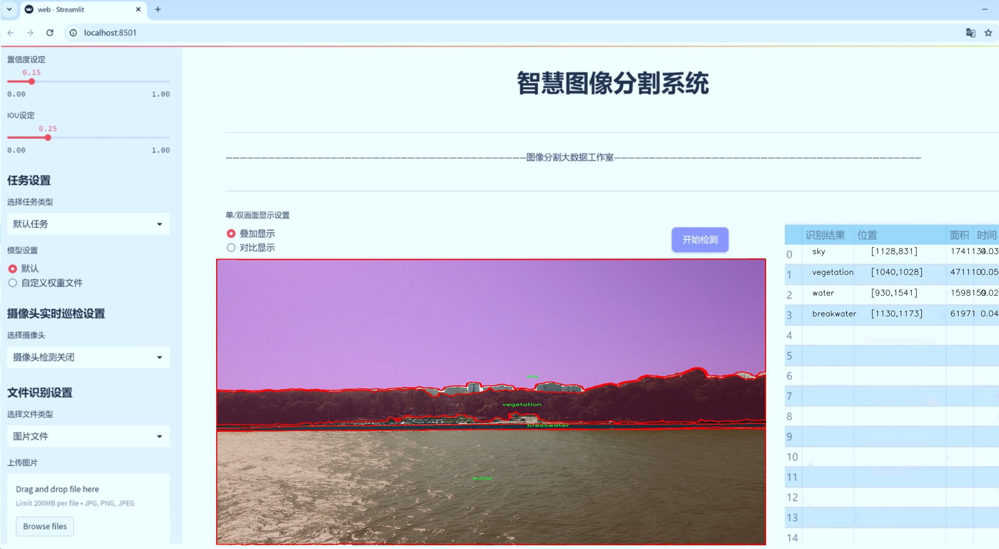
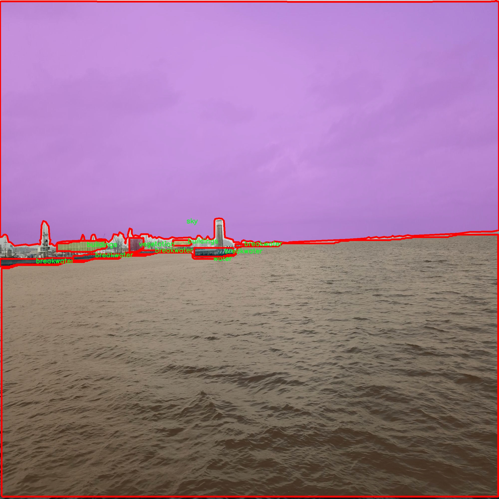
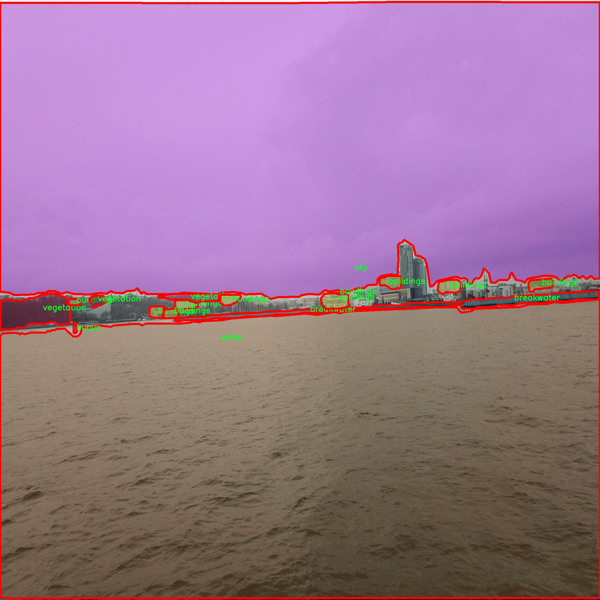
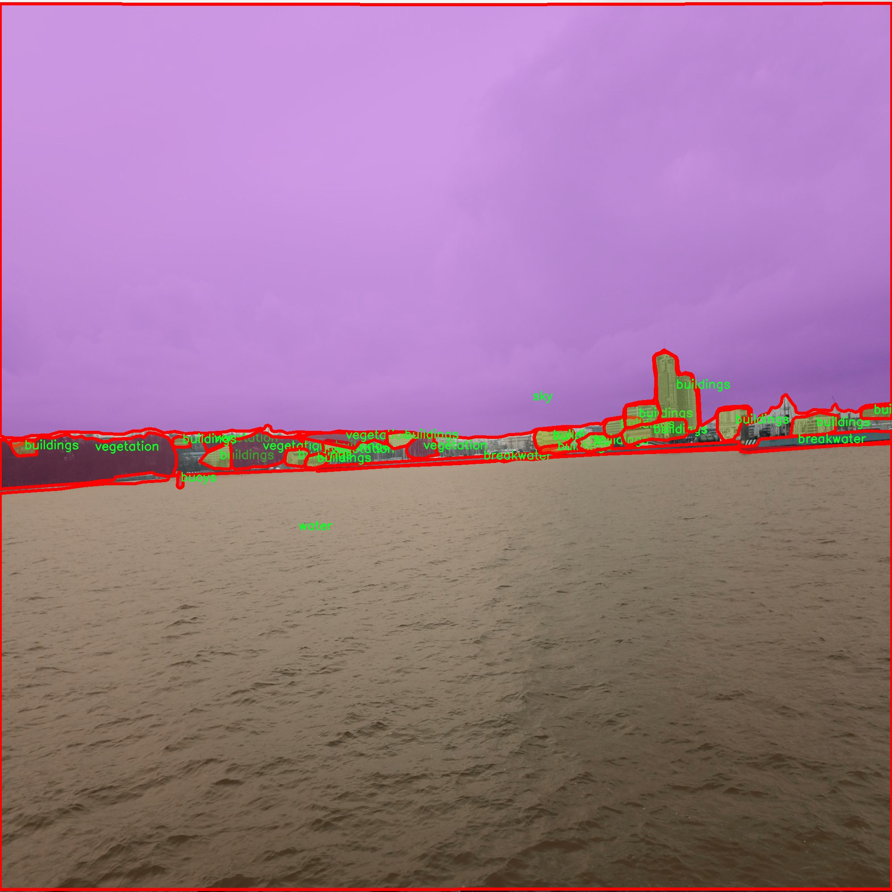
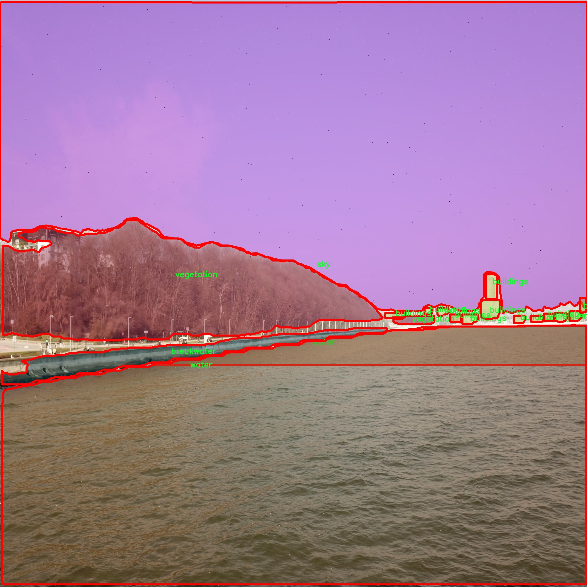

# 海面场景环境图像分割系统： yolov8-seg-ContextGuidedDown

### 1.研究背景与意义

[参考博客](https://gitee.com/YOLOv8_YOLOv11_Segmentation_Studio/projects)

[博客来源](https://kdocs.cn/l/cszuIiCKVNis)

研究背景与意义

随着海洋经济的快速发展和海洋环境保护意识的增强，海面场景的监测与分析变得愈发重要。海洋环境不仅是生态系统的重要组成部分，也是人类经济活动的关键领域。因此，准确识别和分割海面场景中的各种元素，如船只、浮标、建筑物等，对于海洋资源的管理、环境保护以及安全监测等方面具有重要的实际意义。传统的图像处理方法在处理复杂海面场景时往往面临着诸多挑战，如光照变化、波浪干扰和物体遮挡等，这些因素使得图像分割的准确性和鲁棒性受到影响。

近年来，深度学习技术的迅猛发展为图像分割任务提供了新的解决方案。YOLO（You Only Look Once）系列模型因其高效的实时检测能力而广泛应用于目标检测领域。YOLOv8作为该系列的最新版本，进一步提升了模型的精度和速度，适用于复杂场景下的实例分割任务。然而，针对海面场景的特定需求，YOLOv8仍需进行改进，以提高其在海洋环境下的表现。通过对YOLOv8模型的改进，结合海面场景的特点，可以有效提升对不同类别对象的分割精度，进而推动海洋监测技术的发展。

本研究旨在基于改进的YOLOv8模型，构建一个海面场景环境图像分割系统。我们将利用包含1100幅图像的海面场景数据集，该数据集涵盖了8个类别，包括防波堤、建筑物、浮标、山脉、船只、天空、植被和水体。这些类别的多样性使得模型在训练过程中能够学习到丰富的特征，从而提高其在实际应用中的适应性和准确性。通过对这些类别的有效分割，研究将为海洋环境的监测与管理提供更为精准的数据支持，进而促进海洋生态保护和可持续发展。

此外，海洋环境的复杂性和多变性要求我们在图像分割过程中考虑到不同类别之间的相互关系和空间分布。改进YOLOv8模型时，我们将重点关注如何在保持实时性和高效性的同时，提升模型对复杂场景的理解能力。这不仅有助于提高分割的准确性，还能为后续的海洋数据分析提供更为可靠的基础。通过将深度学习与海洋环境监测相结合，本研究将为海洋科学研究、资源管理和环境保护提供新的技术手段和理论支持。

综上所述，基于改进YOLOv8的海面场景环境图像分割系统的研究，不仅具有重要的学术价值，也具备广泛的应用前景。随着海洋环境监测需求的不断增加，开发高效、准确的图像分割技术将为海洋科学的进步和可持续发展提供强有力的支持。

### 2.图片演示







注意：本项目提供完整的训练源码数据集和训练教程,由于此博客编辑较早,暂不提供权重文件（best.pt）,需要按照6.训练教程进行训练后实现上图效果。

### 3.视频演示

[3.1 视频演示](https://www.bilibili.com/video/BV1aCzmY4Ec3/)

### 4.数据集信息

##### 4.1 数据集类别数＆类别名

nc: 8
names: ['breakwater', 'buildings', 'buoys', 'mountains', 'ship', 'sky', 'vegetation', 'water']


##### 4.2 数据集信息简介

数据集信息展示

在本研究中，我们采用了名为“Segmentacja Intancji”的数据集，以支持改进YOLOv8-seg的海面场景环境图像分割系统的训练与评估。该数据集的设计旨在为计算机视觉领域的图像分割任务提供丰富的标注样本，尤其是在海洋和水域环境中。数据集包含8个类别，分别为：防波堤（breakwater）、建筑物（buildings）、浮标（buoys）、山脉（mountains）、船只（ship）、天空（sky）、植被（vegetation）和水域（water）。这些类别的选择不仅反映了海面场景的多样性，也为模型的学习提供了必要的上下文信息。

在图像分割任务中，准确识别和分离不同的物体类别是至关重要的。通过对“Segmentacja Intancji”数据集的分析，我们可以看到每个类别在海面场景中的重要性。例如，防波堤和浮标作为海洋设施，通常出现在海面图像中，它们的存在不仅影响了航行安全，也对海洋生态环境产生了重要影响。建筑物和植被则提供了海岸线的背景信息，帮助模型理解人类活动与自然环境之间的关系。山脉的存在则为场景提供了地理特征，使得模型在进行图像分割时能够更好地理解空间结构。船只作为海洋活动的代表，其准确识别对于海洋监测和交通管理至关重要。

数据集中的天空和水域类别同样不可忽视。天空的变化不仅影响了图像的整体色调，也与天气条件密切相关，而水域则是整个场景的核心部分，涵盖了海洋的动态特性。通过对这些类别的学习，YOLOv8-seg模型能够更好地理解海面场景的复杂性，从而实现更高效的图像分割。

在数据集的构建过程中，研究团队采用了高质量的图像采集和标注技术，确保每个类别的样本都具有代表性和多样性。这种精细的标注工作不仅提升了数据集的质量，也为后续的模型训练提供了坚实的基础。数据集中的图像涵盖了不同的天气条件、时间段和海洋状态，确保了模型在各种实际应用场景中的鲁棒性。

为了评估改进后的YOLOv8-seg模型在海面场景图像分割任务中的表现，我们将使用“Segmentacja Intancji”数据集进行训练和测试。通过对模型在不同类别上的表现进行分析，我们期望能够识别出模型的优缺点，并进一步优化其参数设置和结构设计。这一过程不仅有助于提升模型的分割精度，也为海洋环境监测、航运安全和生态保护等领域的应用提供了技术支持。

综上所述，“Segmentacja Intancji”数据集为我们改进YOLOv8-seg的海面场景环境图像分割系统提供了丰富的训练样本和标注信息，确保了模型在复杂海洋环境中的有效性和可靠性。通过深入分析和利用这一数据集，我们期待能够推动海洋图像分割技术的发展，为相关领域的研究和应用提供新的思路和解决方案。










### 5.项目依赖环境部署教程（零基础手把手教学）

[5.1 环境部署教程链接（零基础手把手教学）](https://www.bilibili.com/video/BV1jG4Ve4E9t/?vd_source=bc9aec86d164b67a7004b996143742dc)


[5.2 安装Python虚拟环境创建和依赖库安装视频教程链接（零基础手把手教学）](https://www.bilibili.com/video/BV1nA4VeYEze/?vd_source=bc9aec86d164b67a7004b996143742dc)

### 6.手把手YOLOV8-seg训练视频教程（零基础手把手教学）

[6.1 手把手YOLOV8-seg训练视频教程（零基础小白有手就能学会）](https://www.bilibili.com/video/BV1cA4VeYETe/?vd_source=bc9aec86d164b67a7004b996143742dc)


按照上面的训练视频教程链接加载项目提供的数据集，运行train.py即可开始训练



     Epoch   gpu_mem       box       obj       cls    labels  img_size
     1/200     0G   0.01576   0.01955  0.007536        22      1280: 100%|██████████| 849/849 [14:42<00:00,  1.04s/it]
               Class     Images     Labels          P          R     mAP@.5 mAP@.5:.95: 100%|██████████| 213/213 [01:14<00:00,  2.87it/s]
                 all       3395      17314      0.994      0.957      0.0957      0.0843

     Epoch   gpu_mem       box       obj       cls    labels  img_size
     2/200     0G   0.01578   0.01923  0.007006        22      1280: 100%|██████████| 849/849 [14:44<00:00,  1.04s/it]
               Class     Images     Labels          P          R     mAP@.5 mAP@.5:.95: 100%|██████████| 213/213 [01:12<00:00,  2.95it/s]
                 all       3395      17314      0.996      0.956      0.0957      0.0845

     Epoch   gpu_mem       box       obj       cls    labels  img_size
     3/200     0G   0.01561    0.0191  0.006895        27      1280: 100%|██████████| 849/849 [10:56<00:00,  1.29it/s]
               Class     Images     Labels          P          R     mAP@.5 mAP@.5:.95: 100%|███████   | 187/213 [00:52<00:00,  4.04it/s]
                 all       3395      17314      0.996      0.957      0.0957      0.0845


### 7.50+种全套YOLOV8-seg创新点加载调参实验视频教程（一键加载写好的改进模型的配置文件）

[7.1 50+种全套YOLOV8-seg创新点加载调参实验视频教程（一键加载写好的改进模型的配置文件）](https://www.bilibili.com/video/BV1Hw4VePEXv/?vd_source=bc9aec86d164b67a7004b996143742dc)

### YOLOV8-seg算法简介

原始YOLOv8-seg算法原理

YOLOv8-seg算法是基于YOLOv8的目标检测框架而发展而来的，专注于图像分割任务。作为2023年1月10日由Ultralytics公司推出的YOLO系列的最新版本，YOLOv8在YOLOv7的基础上进行了深度优化，进一步提升了目标检测和分割的性能。YOLOv8-seg不仅继承了YOLO系列一贯的高效性和实时性，还在图像分割方面引入了新的技术和方法，使其在多个应用场景中表现出色。

YOLOv8-seg的核心在于其深度卷积神经网络结构，能够将整个图像作为输入，直接进行目标检测和分割，而无需依赖传统的滑动窗口或区域提议方法。这种端到端的处理方式极大地提高了检测精度和速度，尤其是在复杂场景下的表现更为突出。YOLOv8-seg采用了多尺度训练和测试的策略，结合特征金字塔网络（FPN）和路径聚合网络（PAN），有效地捕捉不同尺度的特征信息，从而增强了模型对小目标和复杂背景的适应能力。

在网络结构方面，YOLOv8-seg将输入端、主干网络和检测端分为三个主要部分。输入端负责图像的预处理和数据增强，主干网络则采用了CSPDarknet结构，利用C2f模块替代了传统的C3模块，以实现更高效的特征提取。C2f模块通过分支结构和残差连接，能够在保持模型轻量化的同时，获得更丰富的梯度信息，促进了信息的流动和特征的学习。

YOLOv8-seg的检测端采用了先进的解耦合头结构，将分类和分割任务分开处理，这一创新使得模型在处理复杂场景时能够更好地聚焦于目标的特征。同时，YOLOv8-seg摒弃了传统的Anchor-Based方法，转而采用Anchor-Free的策略，直接预测目标的中心点和宽高比例，这一转变不仅简化了模型的设计，还显著提高了检测的速度和准确度。

在训练过程中，YOLOv8-seg引入了动态样本分配策略，利用Task-Aligned Assigner优化了样本的分配，使得模型在训练时能够更有效地学习到目标的特征。此外，YOLOv8-seg在损失计算方面采用了BCELoss作为分类损失，DFLLoss和CIoULoss作为回归损失，这种多重损失函数的设计使得模型在优化过程中能够更全面地考虑目标的定位和分类信息，从而提升了整体性能。

YOLOv8-seg在实际应用中展现出了极大的灵活性和适应性，能够广泛应用于智能监控、自动驾驶、医学影像分析等多个领域。在智能监控中，YOLOv8-seg能够实时检测和分割出监控画面中的人、车等目标，为安全管理提供了有力的支持。在自动驾驶领域，YOLOv8-seg可以精准识别道路上的行人、车辆及交通标志，确保行车安全。而在医学影像分析中，YOLOv8-seg则能够帮助医生快速识别和分割出病灶区域，提高诊断的效率和准确性。

总的来说，YOLOv8-seg算法通过对YOLOv8的深度优化和创新，成功地将目标检测与图像分割相结合，形成了一种高效、准确的解决方案。其在特征提取、目标检测和分割任务中的出色表现，使其成为当前计算机视觉领域中一个重要的研究方向。随着技术的不断进步，YOLOv8-seg无疑将在更多的实际应用中发挥重要作用，推动相关领域的发展与创新。


### 9.系统功能展示（检测对象为举例，实际内容以本项目数据集为准）

图9.1.系统支持检测结果表格显示

  图9.2.系统支持置信度和IOU阈值手动调节

  图9.3.系统支持自定义加载权重文件best.pt(需要你通过步骤5中训练获得)

  图9.4.系统支持摄像头实时识别

  图9.5.系统支持图片识别

  图9.6.系统支持视频识别

  图9.7.系统支持识别结果文件自动保存

  图9.8.系统支持Excel导出检测结果数据


### 10.50+种全套YOLOV8-seg创新点原理讲解（非科班也可以轻松写刊发刊，V11版本正在科研待更新）

#### 10.1 由于篇幅限制，每个创新点的具体原理讲解就不一一展开，具体见下列网址中的创新点对应子项目的技术原理博客网址【Blog】：


[10.1 50+种全套YOLOV8-seg创新点原理讲解链接](https://gitee.com/qunmasj/good)

#### 10.2 部分改进模块原理讲解(完整的改进原理见上图和技术博客链接)【如果此小节的图加载失败可以通过CSDN或者Github搜索该博客的标题访问原始博客，原始博客图片显示正常】
### YOLOv8简介
#### Yolov8网络模型
Yolov8n的网络分为输入端、主干网( Back-bone) 、Neck模块和输出端4个部分（图4)。输
人端主要有马赛克( Mosaic）数据增强、自适应锚框计算和自适应灰度填充。主干网有Conv、C2和SPPF结构，其中，C2r模块是对残差特征进行学习的主要模块，该模块仿照Yolov7的ELAN结构,通过更多的分支跨层连接，丰富了模型的梯度流，可形成一个具有更强特征表示能力的神经网络模
块。Neck模块采用PAN ( path aggregation nelwOrk ,结构，可加强网络对不同缩放尺度对象特征融合的
能力。输出端将分类和检测过程进行解耦，主要包括损失计算和目标检测框筛选，其中，损失计算过程主要包括正负样本分配策略和 Loss计算，Yolov8n 网络主要使用TaskAlignedAssignerl 10]方法，即根据分类与回归的分数加权结果选择正样本;Loss计算包括分类和回归2个分支，无Ob-jecIness分支。分类分支依然采用BCE Loss，回归分支则使用了Distribution Focal Loss!11〕和CIOU( complele inlersection over union)损失函数。

### 可扩张残差（DWR）注意力模块
当前的许多工作直接采用多速率深度扩张卷积从一个输入特征图中同时捕获多尺度上下文信息，从而提高实时语义分割的特征提取效率。 然而，这种设计可能会因为结构和超参数的不合理而导致多尺度上下文信息的访问困难。 为了降低绘制多尺度上下文信息的难度，我们提出了一种高效的多尺度特征提取方法，该方法分解了原始的单步特征提取方法方法分为两个步骤，区域残差-语义残差。 在该方法中，多速率深度扩张卷积在特征提取中发挥更简单的作用：根据第一步提供的每个简明区域形式特征图，在第二步中使用一个所需的感受野执行简单的基于语义的形态过滤 一步，提高他们的效率。 此外，扩张率和扩张卷积的容量每个网络阶段都经过精心设计，以充分利用所有可以实现的区域形式的特征图。 因此，我们分别为高层和低层网络设计了一种新颖的扩张式残差（DWR）模块和简单倒置残差（SIR）模块。


首先，该博客引入了一个Dilation-wise Residual（DWR）模块，用于提取网络高层的特征，如图2a所示。多分支结构用于扩展感受野，其中每个分支采用不同空洞率的空洞深度卷积。
然后，专门设计了一个Simple Inverted Residual（SIR）模块来提取网络低层的特征，如图2b所示。该模块仅具有3×3的微小感受野，但使用inverted bottleneck式结构来扩展通道数量，确保更强的特征提取能力。
最后，基于DWR和SIR模块，构建了一个编码器-解码器风格的网络DWRSeg，其中解码器采用了简单的类似FCN的结构。解码器使用来自最后两个阶段的强语义信息直接对特征图进行上采样，然后将它们与来自较低阶段的特征图（包含丰富的详细信息）拼接起来，以进行最终预测。


### 11.项目核心源码讲解（再也不用担心看不懂代码逻辑）

#### 11.1 log.py

以下是经过简化和注释的核心代码部分，保留了主要功能并添加了详细的中文注释：

```python
import os
import time
import cv2
import pandas as pd
from PIL import Image

def save_chinese_image(file_path, image_array):
    """
    保存带有中文路径的图片文件

    参数：
    file_path (str): 图片的保存路径，应包含中文字符
    image_array (numpy.ndarray): 要保存的 OpenCV 图像（即 numpy 数组）
    """
    try:
        # 将 OpenCV 图片转换为 Pillow Image 对象
        image = Image.fromarray(cv2.cvtColor(image_array, cv2.COLOR_BGR2RGB))
        # 使用 Pillow 保存图片文件
        image.save(file_path)
        print(f"成功保存图像到: {file_path}")
    except Exception as e:
        print(f"保存图像失败: {str(e)}")

class ResultLogger:
    def __init__(self):
        """
        初始化ResultLogger类，创建一个空的结果DataFrame。
        """
        self.results_df = pd.DataFrame(columns=["识别结果", "位置", "面积", "时间"])

    def concat_results(self, result, location, confidence, time):
        """
        将检测结果添加到结果DataFrame中。

        参数：
            result (str): 检测结果。
            location (str): 检测位置。
            confidence (str): 置信度。
            time (str): 检出目标所在时间。

        返回：
            pd.DataFrame: 更新后的DataFrame。
        """
        # 创建一个包含这些信息的字典
        result_data = {
            "识别结果": [result],
            "位置": [location],
            "面积": [confidence],
            "时间": [time]
        }
        # 创建一个新的DataFrame并将其添加到实例的DataFrame
        new_row = pd.DataFrame(result_data)
        self.results_df = pd.concat([self.results_df, new_row], ignore_index=True)
        return self.results_df

class LogTable:
    def __init__(self, csv_file_path=None):
        """
        初始化LogTable类实例。

        参数：
            csv_file_path (str): 保存初始数据的CSV文件路径。
        """
        self.csv_file_path = csv_file_path
        self.data = pd.DataFrame(columns=['文件路径', '识别结果', '位置', '面积', '时间'])

        # 尝试从CSV文件加载数据
        if csv_file_path and os.path.exists(csv_file_path):
            self.data = pd.read_csv(csv_file_path, encoding='utf-8')

    def add_log_entry(self, file_path, recognition_result, position, confidence, time_spent):
        """
        向日志中添加一条新记录。

        参数：
            file_path (str): 文件路径
            recognition_result (str): 识别结果
            position (str): 位置
            confidence (float): 置信度
            time_spent (float): 用时（通常是秒或毫秒）

        返回：
            None
        """
        # 创建新的数据行
        new_entry = pd.DataFrame([[file_path, recognition_result, position, confidence, time_spent]],
                                 columns=['文件路径', '识别结果', '位置', '面积', '时间'])
        # 将新行添加到DataFrame中
        self.data = pd.concat([new_entry, self.data]).reset_index(drop=True)

    def save_to_csv(self):
        """
        将更新后的DataFrame保存到CSV文件。
        """
        self.data.to_csv(self.csv_file_path, index=False, encoding='utf-8', mode='a', header=False)

    def update_table(self, log_table_placeholder):
        """
        更新表格，显示最新的500条记录。

        参数：
            log_table_placeholder: Streamlit的表格占位符

        返回：
            None
        """
        # 判断DataFrame的长度是否超过500
        display_data = self.data.head(500) if len(self.data) > 500 else self.data
        log_table_placeholder.table(display_data)
```

### 代码分析与注释说明：
1. **保存带有中文路径的图片**：
   - `save_chinese_image` 函数负责将图像保存到指定路径，支持中文字符的文件名。

2. **结果记录器**：
   - `ResultLogger` 类用于记录检测结果，提供方法 `concat_results` 来添加新的检测结果到 DataFrame 中。

3. **日志表管理**：
   - `LogTable` 类用于管理日志数据，支持从 CSV 文件加载数据、添加新记录、保存到 CSV 文件以及更新显示表格。

4. **数据处理**：
   - 通过 `add_log_entry` 方法添加新记录，并在 `save_to_csv` 方法中将数据保存到 CSV 文件。

5. **表格更新**：
   - `update_table` 方法用于更新和显示最新的记录，确保界面上只显示最新的500条数据。

以上是代码的核心部分和详细注释，确保了代码的功能和可读性。

这个 `log.py` 文件主要用于处理图像和日志记录，包含了几个重要的类和函数。首先，文件导入了一些必要的库，包括操作系统处理、时间处理、图像处理（OpenCV和Pillow）、数据处理（Pandas）以及日期时间处理。

文件中定义了一个函数 `save_chinese_image`，该函数用于保存带有中文路径的图像。它接受两个参数：文件路径和图像数组。函数内部首先将OpenCV格式的图像转换为Pillow格式，然后尝试保存图像到指定路径。如果保存成功，会打印成功信息；如果失败，则会捕获异常并打印错误信息。

接下来是 `ResultLogger` 类，它用于记录检测结果。初始化时，该类创建了一个空的Pandas DataFrame，包含“识别结果”、“位置”、“面积”和“时间”四个列。`concat_results` 方法用于将新的检测结果添加到DataFrame中，方法接收检测结果、位置、置信度和时间，并将这些信息作为新行添加到DataFrame中。

然后是 `LogTable` 类，它用于管理图像帧和日志记录。初始化时，它可以接受一个CSV文件路径，用于保存初始数据。如果指定的CSV文件不存在，类会创建一个带有表头的空DataFrame。该类还包含多个方法，包括 `add_frames` 用于添加图像和检测信息，`clear_frames` 用于清空保存的图像和结果，`save_frames_file` 用于保存图像或视频，`add_log_entry` 用于向日志中添加新记录，`clear_data` 用于清空数据，`save_to_csv` 用于将DataFrame保存到CSV文件，以及 `update_table` 用于更新表格以显示最新的记录。

在 `save_frames_file` 方法中，如果保存的图像列表不为空，方法会根据图像数量决定是保存为单张图片还是视频。如果只有一张图像，保存为PNG格式；如果有多张图像，则保存为AVI格式的视频。保存时，文件名会包含当前的时间戳，以确保唯一性。

总体来说，这个文件提供了图像处理和日志记录的功能，适合用于需要记录图像处理结果的应用场景，比如计算机视觉项目。

#### 11.2 ultralytics\utils\callbacks\raytune.py

以下是代码中最核心的部分，并附上详细的中文注释：

```python
# 导入必要的库和模块
from ultralytics.utils import SETTINGS

# 尝试导入Ray库并验证Ray Tune集成是否启用
try:
    assert SETTINGS['raytune'] is True  # 验证Ray Tune集成是否启用
    import ray
    from ray import tune
    from ray.air import session
except (ImportError, AssertionError):
    tune = None  # 如果导入失败或集成未启用，则将tune设置为None

def on_fit_epoch_end(trainer):
    """在每个训练周期结束时，将训练指标发送到Ray Tune。"""
    if ray.tune.is_session_enabled():  # 检查Ray Tune会话是否启用
        metrics = trainer.metrics  # 获取当前训练的指标
        metrics['epoch'] = trainer.epoch  # 将当前周期数添加到指标中
        session.report(metrics)  # 将指标报告给Ray Tune

# 定义回调函数字典，如果tune可用，则包含on_fit_epoch_end回调
callbacks = {
    'on_fit_epoch_end': on_fit_epoch_end, 
} if tune else {}
```

### 代码核心部分解释：
1. **导入设置和库**：首先从`ultralytics.utils`导入`SETTINGS`，然后尝试导入Ray库及其相关模块，确保Ray Tune的集成可用。
2. **异常处理**：如果导入失败或Ray Tune未启用，`tune`将被设置为`None`，这意味着后续代码中与Ray Tune相关的功能将不可用。
3. **回调函数**：定义了一个名为`on_fit_epoch_end`的函数，该函数在每个训练周期结束时被调用。它负责将训练过程中的指标发送到Ray Tune，以便进行监控和调优。
4. **回调字典**：根据`tune`是否可用，构建一个包含回调函数的字典，用于在训练过程中自动调用相应的函数。

这个程序文件的主要功能是将训练过程中的指标（metrics）发送到Ray Tune，这是一个用于超参数调优的库。文件首先导入了必要的模块和设置。它从`ultralytics.utils`中导入了`SETTINGS`，并尝试验证Ray Tune的集成是否被启用。如果`SETTINGS['raytune']`为真，则导入Ray及其相关模块；如果导入失败或集成未启用，则将`tune`设置为`None`。

接下来，定义了一个名为`on_fit_epoch_end`的函数，该函数在每个训练周期结束时被调用。它的作用是检查Ray Tune的会话是否已启用，如果启用，则获取当前训练器的指标，并将当前的训练周期（epoch）添加到指标中。然后，通过`session.report(metrics)`将这些指标报告给Ray Tune，以便进行监控和调优。

最后，文件定义了一个`callbacks`字典，如果`tune`不为`None`，则将`on_fit_epoch_end`函数作为回调函数添加到字典中。这意味着只有在Ray Tune可用的情况下，才会注册这个回调。整体上，这段代码的目的是为了在使用Ultralytics YOLO进行训练时，能够方便地与Ray Tune进行集成，从而实现更高效的超参数调优。

#### 11.3 ultralytics\models\nas\__init__.py

以下是代码中最核心的部分，并附上详细的中文注释：

```python
# 导入必要的模块和类
from .model import NAS  # 从当前包的model模块中导入NAS类
from .predict import NASPredictor  # 从当前包的predict模块中导入NASPredictor类
from .val import NASValidator  # 从当前包的val模块中导入NASValidator类

# 定义模块的公开接口
__all__ = 'NASPredictor', 'NASValidator', 'NAS'  # 指定在使用from <module> import *时，允许导入的类
```

### 注释说明：
1. **导入模块**：
   - `from .model import NAS`：这行代码从当前包的`model`模块中导入了`NAS`类，`NAS`通常是一个模型类，可能用于构建或定义神经网络架构。
   - `from .predict import NASPredictor`：这行代码从当前包的`predict`模块中导入了`NASPredictor`类，`NASPredictor`可能用于进行模型的预测操作。
   - `from .val import NASValidator`：这行代码从当前包的`val`模块中导入了`NASValidator`类，`NASValidator`可能用于验证模型的性能或准确性。

2. **定义公开接口**：
   - `__all__`：这是一个特殊的变量，用于定义当使用`from <module> import *`时，哪些名称是可以被导入的。在这里，只有`NASPredictor`、`NASValidator`和`NAS`这三个类会被导入，其他未列出的名称将不会被导入。这有助于控制模块的公共API，避免不必要的名称冲突和隐藏实现细节。

这个程序文件是Ultralytics YOLO项目中的一个初始化文件，位于`ultralytics\models\nas\__init__.py`。它的主要功能是定义该模块的公共接口。

文件开头的注释表明该项目使用的是AGPL-3.0许可证，并且是Ultralytics YOLO的一部分。接下来，文件通过`from`语句导入了三个类：`NAS`、`NASPredictor`和`NASValidator`。这些类分别来自于同一目录下的`model`、`predict`和`val`模块。

最后，`__all__`变量被定义为一个元组，包含了三个字符串，分别对应于刚刚导入的类名。这意味着当使用`from ultralytics.models.nas import *`语句时，只会导入`NASPredictor`、`NASValidator`和`NAS`这三个类。这种做法有助于控制模块的公共接口，避免不必要的内部实现细节被暴露给用户。

总的来说，这个文件的作用是将相关的类组织在一起，并提供一个清晰的接口供外部使用。

#### 11.4 ultralytics\trackers\track.py

以下是代码中最核心的部分，并附上详细的中文注释：

```python
# 导入必要的库和模块
from functools import partial
import torch
from ultralytics.utils import IterableSimpleNamespace, yaml_load
from ultralytics.utils.checks import check_yaml
from .bot_sort import BOTSORT
from .byte_tracker import BYTETracker

# 定义一个跟踪器映射字典，方便根据名称获取对应的跟踪器类
TRACKER_MAP = {'bytetrack': BYTETracker, 'botsort': BOTSORT}

def on_predict_start(predictor, persist=False):
    """
    在预测开始时初始化对象跟踪器。

    参数:
        predictor (object): 要为其初始化跟踪器的预测器对象。
        persist (bool, optional): 如果跟踪器已存在，是否保持它们。默认为 False。

    异常:
        AssertionError: 如果 tracker_type 不是 'bytetrack' 或 'botsort'。
    """
    # 如果预测器已经有跟踪器且选择保持，则直接返回
    if hasattr(predictor, 'trackers') and persist:
        return
    
    # 检查并加载跟踪器的配置文件
    tracker = check_yaml(predictor.args.tracker)
    cfg = IterableSimpleNamespace(**yaml_load(tracker))
    
    # 确保跟踪器类型是支持的类型
    assert cfg.tracker_type in ['bytetrack', 'botsort'], \
        f"只支持 'bytetrack' 和 'botsort'，但得到了 '{cfg.tracker_type}'"
    
    # 初始化跟踪器列表
    trackers = []
    for _ in range(predictor.dataset.bs):  # 根据批次大小创建跟踪器
        tracker = TRACKER_MAP[cfg.tracker_type](args=cfg, frame_rate=30)
        trackers.append(tracker)
    
    # 将创建的跟踪器列表赋值给预测器
    predictor.trackers = trackers

def on_predict_postprocess_end(predictor):
    """后处理检测到的框并更新对象跟踪。"""
    bs = predictor.dataset.bs  # 批次大小
    im0s = predictor.batch[1]  # 获取输入图像
    for i in range(bs):
        det = predictor.results[i].boxes.cpu().numpy()  # 获取检测结果
        if len(det) == 0:  # 如果没有检测到物体，跳过
            continue
        
        # 更新跟踪器并获取跟踪结果
        tracks = predictor.trackers[i].update(det, im0s[i])
        if len(tracks) == 0:  # 如果没有跟踪到物体，跳过
            continue
        
        idx = tracks[:, -1].astype(int)  # 获取跟踪索引
        predictor.results[i] = predictor.results[i][idx]  # 更新检测结果
        predictor.results[i].update(boxes=torch.as_tensor(tracks[:, :-1]))  # 更新框信息

def register_tracker(model, persist):
    """
    为模型注册跟踪回调，以便在预测期间进行对象跟踪。

    参数:
        model (object): 要为其注册跟踪回调的模型对象。
        persist (bool): 如果跟踪器已存在，是否保持它们。
    """
    # 添加预测开始时的回调
    model.add_callback('on_predict_start', partial(on_predict_start, persist=persist))
    # 添加后处理结束时的回调
    model.add_callback('on_predict_postprocess_end', on_predict_postprocess_end)
```

### 代码说明：
1. **导入模块**：引入了必要的库和自定义模块，主要用于对象跟踪和配置管理。
2. **跟踪器映射**：使用字典将跟踪器名称映射到具体的跟踪器类，方便后续根据配置动态创建跟踪器实例。
3. **`on_predict_start` 函数**：在预测开始时初始化跟踪器。它会检查是否已经存在跟踪器，如果没有则根据配置文件创建新的跟踪器实例。
4. **`on_predict_postprocess_end` 函数**：在预测后处理阶段，更新检测结果和跟踪信息。它会遍历每个批次的结果，调用对应的跟踪器进行更新，并将跟踪结果应用到检测结果中。
5. **`register_tracker` 函数**：为模型注册跟踪回调函数，以便在预测过程中自动调用这些函数。通过使用 `partial`，可以将 `persist` 参数传递给 `on_predict_start` 函数。

这个程序文件是用于实现目标跟踪功能的，主要依赖于Ultralytics YOLO框架。文件中定义了一些函数和类，用于在预测过程中初始化和管理目标跟踪器。

首先，文件导入了一些必要的库和模块，包括`torch`和一些Ultralytics的工具函数。接着，定义了一个映射字典`TRACKER_MAP`，将跟踪器的名称映射到相应的类（`BYTETracker`和`BOTSORT`），这两个类分别实现了不同的目标跟踪算法。

在`on_predict_start`函数中，首先检查预测器对象是否已经有跟踪器，如果已经存在且`persist`参数为真，则直接返回。然后，通过`check_yaml`函数读取配置文件，确保跟踪器类型是支持的（目前只支持`bytetrack`和`botsort`）。接下来，初始化一个跟踪器列表，根据批次大小（`predictor.dataset.bs`）创建相应数量的跟踪器实例，并将其存储在预测器对象的`trackers`属性中。

`on_predict_postprocess_end`函数则是在预测后处理阶段调用的。它会遍历每个批次的结果，提取检测到的框（`det`），如果没有检测到框则跳过。对于每个检测到的框，调用相应的跟踪器的`update`方法进行更新，并根据跟踪结果更新预测结果。具体来说，提取跟踪结果中的索引，使用这些索引更新预测结果中的框信息。

最后，`register_tracker`函数用于将跟踪回调函数注册到模型中，以便在预测过程中能够自动调用这些函数。它使用`model.add_callback`方法将`on_predict_start`和`on_predict_postprocess_end`函数注册到模型的预测流程中。

整体来看，这个文件的主要功能是为Ultralytics YOLO模型提供目标跟踪的支持，通过初始化和更新跟踪器来增强检测结果的连贯性和准确性。

#### 11.5 ultralytics\nn\extra_modules\ops_dcnv3\setup.py

以下是代码中最核心的部分，并附上详细的中文注释：

```python
import os
import glob
import torch
from torch.utils.cpp_extension import CUDA_HOME, CppExtension, CUDAExtension
from setuptools import find_packages, setup

# 定义依赖包
requirements = ["torch", "torchvision"]

def get_extensions():
    # 获取当前文件的目录
    this_dir = os.path.dirname(os.path.abspath(__file__))
    # 定义扩展源代码的目录
    extensions_dir = os.path.join(this_dir, "src")

    # 查找主文件和CPU、CUDA源文件
    main_file = glob.glob(os.path.join(extensions_dir, "*.cpp"))
    source_cpu = glob.glob(os.path.join(extensions_dir, "cpu", "*.cpp"))
    source_cuda = glob.glob(os.path.join(extensions_dir, "cuda", "*.cu"))

    # 将主文件和CPU源文件合并
    sources = main_file + source_cpu
    extension = CppExtension  # 默认使用 CppExtension
    extra_compile_args = {"cxx": []}  # 编译参数
    define_macros = []  # 宏定义

    # 检查CUDA是否可用
    if torch.cuda.is_available() and CUDA_HOME is not None:
        extension = CUDAExtension  # 使用 CUDAExtension
        sources += source_cuda  # 添加CUDA源文件
        define_macros += [("WITH_CUDA", None)]  # 定义宏
        extra_compile_args["nvcc"] = []  # NVCC编译参数
    else:
        raise NotImplementedError('Cuda is not available')  # 抛出异常

    # 构建完整的源文件路径
    sources = [os.path.join(extensions_dir, s) for s in sources]
    include_dirs = [extensions_dir]  # 包含目录

    # 创建扩展模块
    ext_modules = [
        extension(
            "DCNv3",  # 模块名称
            sources,  # 源文件列表
            include_dirs=include_dirs,  # 包含目录
            define_macros=define_macros,  # 宏定义
            extra_compile_args=extra_compile_args,  # 编译参数
        )
    ]
    return ext_modules  # 返回扩展模块列表

# 设置包信息
setup(
    name="DCNv3",  # 包名称
    version="1.1",  # 版本号
    author="InternImage",  # 作者
    url="https://github.com/OpenGVLab/InternImage",  # 项目网址
    description="PyTorch Wrapper for CUDA Functions of DCNv3",  # 描述
    packages=find_packages(exclude=("configs", "tests")),  # 查找包
    ext_modules=get_extensions(),  # 获取扩展模块
    cmdclass={"build_ext": torch.utils.cpp_extension.BuildExtension},  # 自定义构建命令
)
```

### 代码说明：
1. **导入必要的库**：引入了处理文件路径、CUDA扩展和设置包的相关库。
2. **定义依赖包**：指定了该项目依赖的库。
3. **获取扩展函数**：`get_extensions` 函数用于查找源文件并根据CUDA的可用性选择合适的扩展类型（CPU或CUDA）。
4. **检查CUDA可用性**：如果CUDA不可用，抛出异常。
5. **构建扩展模块**：根据找到的源文件和其他参数创建扩展模块。
6. **设置包信息**：使用 `setuptools` 的 `setup` 函数定义包的基本信息和扩展模块。

这个程序文件是一个用于设置和编译深度学习扩展模块的 Python 脚本，主要是为 PyTorch 提供一个名为 DCNv3 的 CUDA 扩展。文件的开头包含版权信息和许可证声明，表明该代码是由 OpenGVLab 开发并遵循 MIT 许可证。

首先，脚本导入了一些必要的库，包括操作系统相关的 `os` 和 `glob`，以及 PyTorch 的相关模块，特别是用于处理 C++ 扩展的 `torch.utils.cpp_extension` 中的 `CppExtension` 和 `CUDAExtension`。同时，还导入了 `setuptools` 库中的 `find_packages` 和 `setup` 函数，用于包的管理和安装。

接下来，定义了一个 `requirements` 列表，列出了该扩展所依赖的库，这里包括 `torch` 和 `torchvision`。

`get_extensions` 函数是该脚本的核心部分。它首先获取当前文件的目录，并构建出扩展源代码的目录路径。然后，使用 `glob` 模块查找该目录下的所有 C++ 源文件，包括主文件、CPU 相关的源文件和 CUDA 相关的源文件。

在构建源文件列表时，默认使用 `CppExtension`，并设置了一些编译参数和宏定义。如果系统中可用 CUDA，且 `CUDA_HOME` 环境变量已设置，则会切换到使用 `CUDAExtension`，并将 CUDA 源文件添加到源文件列表中，同时定义了一个宏 `WITH_CUDA`。如果 CUDA 不可用，则抛出一个未实现的错误。

最后，构建的源文件路径被整理，并指定了包含目录。然后，创建了一个扩展模块的列表，包含了扩展的名称、源文件、包含目录、宏定义和编译参数。

在脚本的最后，调用 `setup` 函数来配置包的元数据，包括包名、版本、作者、项目网址、描述信息等，同时调用 `get_extensions` 函数获取扩展模块，并指定构建扩展时使用的命令类。

总的来说，这个 `setup.py` 文件的主要功能是为 DCNv3 扩展模块的编译和安装提供配置，确保在合适的环境下正确构建和链接 CUDA 代码。

### 12.系统整体结构（节选）

### 程序整体功能和构架概括

该程序是一个基于Ultralytics YOLO框架的深度学习项目，主要用于目标检测和跟踪。它包含多个模块，分别负责不同的功能，包括日志记录、超参数调优、模型初始化、目标跟踪以及扩展模块的编译和安装。整体架构清晰，模块化设计使得各个功能可以独立开发和维护，同时又能通过接口进行有效的集成。

- **log.py**: 处理图像保存和结果记录，提供日志功能。
- **raytune.py**: 集成Ray Tune以进行超参数调优，提供训练过程中的指标报告。
- **__init__.py**: 定义NAS（神经架构搜索）模块的公共接口，便于外部调用。
- **track.py**: 实现目标跟踪功能，管理跟踪器的初始化和更新。
- **setup.py**: 配置和编译深度学习扩展模块，主要是DCNv3的CUDA扩展。

### 文件功能整理表

| 文件路径                                         | 功能描述                                                     |
|--------------------------------------------------|------------------------------------------------------------|
| `C:\codeseg\codenew\code\log.py`                | 处理图像保存和日志记录，提供结果记录功能。                 |
| `C:\codeseg\codenew\code\ultralytics\utils\callbacks\raytune.py` | 集成Ray Tune进行超参数调优，报告训练过程中的指标。         |
| `C:\codeseg\codenew\code\ultralytics\models\nas\__init__.py` | 定义NAS模块的公共接口，便于外部调用相关类。                 |
| `C:\codeseg\codenew\code\ultralytics\trackers\track.py` | 实现目标跟踪功能，管理跟踪器的初始化和更新。                 |
| `C:\codeseg\codenew\code\ultralytics\nn\extra_modules\ops_dcnv3\setup.py` | 配置和编译深度学习扩展模块，主要是DCNv3的CUDA扩展。       |

这个表格清晰地总结了每个文件的主要功能，便于理解整个项目的结构和各个模块的作用。

### 13.图片、视频、摄像头图像分割Demo(去除WebUI)代码

在这个博客小节中，我们将讨论如何在不使用WebUI的情况下，实现图像分割模型的使用。本项目代码已经优化整合，方便用户将分割功能嵌入自己的项目中。
核心功能包括图片、视频、摄像头图像的分割，ROI区域的轮廓提取、类别分类、周长计算、面积计算、圆度计算以及颜色提取等。
这些功能提供了良好的二次开发基础。

### 核心代码解读

以下是主要代码片段，我们会为每一块代码进行详细的批注解释：

```python
import random
import cv2
import numpy as np
from PIL import ImageFont, ImageDraw, Image
from hashlib import md5
from model import Web_Detector
from chinese_name_list import Label_list

# 根据名称生成颜色
def generate_color_based_on_name(name):
    ......

# 计算多边形面积
def calculate_polygon_area(points):
    return cv2.contourArea(points.astype(np.float32))

...
# 绘制中文标签
def draw_with_chinese(image, text, position, font_size=20, color=(255, 0, 0)):
    image_pil = Image.fromarray(cv2.cvtColor(image, cv2.COLOR_BGR2RGB))
    draw = ImageDraw.Draw(image_pil)
    font = ImageFont.truetype("simsun.ttc", font_size, encoding="unic")
    draw.text(position, text, font=font, fill=color)
    return cv2.cvtColor(np.array(image_pil), cv2.COLOR_RGB2BGR)

# 动态调整参数
def adjust_parameter(image_size, base_size=1000):
    max_size = max(image_size)
    return max_size / base_size

# 绘制检测结果
def draw_detections(image, info, alpha=0.2):
    name, bbox, conf, cls_id, mask = info['class_name'], info['bbox'], info['score'], info['class_id'], info['mask']
    adjust_param = adjust_parameter(image.shape[:2])
    spacing = int(20 * adjust_param)

    if mask is None:
        x1, y1, x2, y2 = bbox
        aim_frame_area = (x2 - x1) * (y2 - y1)
        cv2.rectangle(image, (x1, y1), (x2, y2), color=(0, 0, 255), thickness=int(3 * adjust_param))
        image = draw_with_chinese(image, name, (x1, y1 - int(30 * adjust_param)), font_size=int(35 * adjust_param))
        y_offset = int(50 * adjust_param)  # 类别名称上方绘制，其下方留出空间
    else:
        mask_points = np.concatenate(mask)
        aim_frame_area = calculate_polygon_area(mask_points)
        mask_color = generate_color_based_on_name(name)
        try:
            overlay = image.copy()
            cv2.fillPoly(overlay, [mask_points.astype(np.int32)], mask_color)
            image = cv2.addWeighted(overlay, 0.3, image, 0.7, 0)
            cv2.drawContours(image, [mask_points.astype(np.int32)], -1, (0, 0, 255), thickness=int(8 * adjust_param))

            # 计算面积、周长、圆度
            area = cv2.contourArea(mask_points.astype(np.int32))
            perimeter = cv2.arcLength(mask_points.astype(np.int32), True)
            ......

            # 计算色彩
            mask = np.zeros(image.shape[:2], dtype=np.uint8)
            cv2.drawContours(mask, [mask_points.astype(np.int32)], -1, 255, -1)
            color_points = cv2.findNonZero(mask)
            ......

            # 绘制类别名称
            x, y = np.min(mask_points, axis=0).astype(int)
            image = draw_with_chinese(image, name, (x, y - int(30 * adjust_param)), font_size=int(35 * adjust_param))
            y_offset = int(50 * adjust_param)

            # 绘制面积、周长、圆度和色彩值
            metrics = [("Area", area), ("Perimeter", perimeter), ("Circularity", circularity), ("Color", color_str)]
            for idx, (metric_name, metric_value) in enumerate(metrics):
                ......

    return image, aim_frame_area

# 处理每帧图像
def process_frame(model, image):
    pre_img = model.preprocess(image)
    pred = model.predict(pre_img)
    det = pred[0] if det is not None and len(det)
    if det:
        det_info = model.postprocess(pred)
        for info in det_info:
            image, _ = draw_detections(image, info)
    return image

if __name__ == "__main__":
    cls_name = Label_list
    model = Web_Detector()
    model.load_model("./weights/yolov8s-seg.pt")

    # 摄像头实时处理
    cap = cv2.VideoCapture(0)
    while cap.isOpened():
        ret, frame = cap.read()
        if not ret:
            break
        ......

    # 图片处理
    image_path = './icon/OIP.jpg'
    image = cv2.imread(image_path)
    if image is not None:
        processed_image = process_frame(model, image)
        ......

    # 视频处理
    video_path = ''  # 输入视频的路径
    cap = cv2.VideoCapture(video_path)
    while cap.isOpened():
        ret, frame = cap.read()
        ......
```


### 14.完整训练+Web前端界面+50+种创新点源码、数据集获取


# [下载链接：https://mbd.pub/o/bread/Z5yWlppy](https://mbd.pub/o/bread/Z5yWlppy)